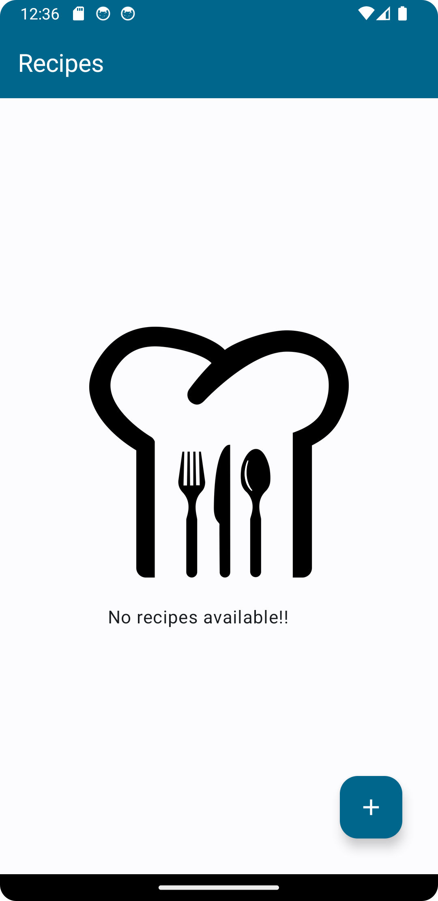
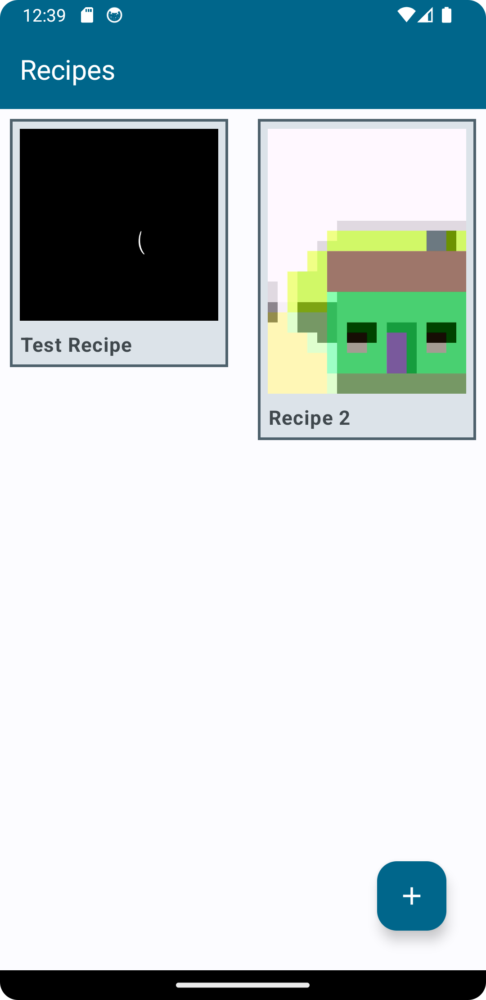
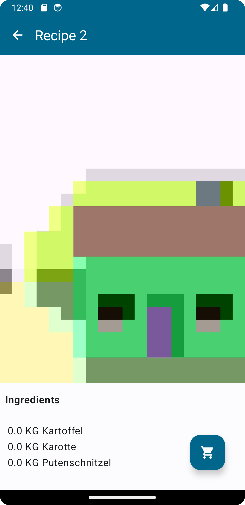

# project-meal

Introducing project-meal, the app for creating, storing, and organizing recipes. 
Create recipes and conveniently generate a shopping list based on the meals you want to cook. 

This project is a training project to deepen my knowledge of Jetpack Compose as well as architectural patterns in Android.

  
